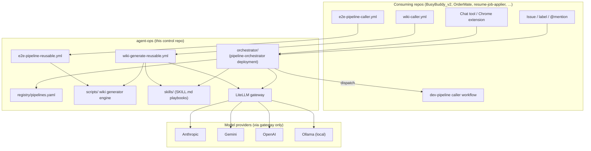

# agent-ops

**The control plane for a small fleet of AI dev & personal automation pipelines.**

`agent-ops` is a single control repo that a handful of *other* repos consume
from. It doesn't ship one product — it ships the shared machinery that several
app repos and personal projects reuse:

- a **pipeline orchestrator** (a thin deployment on top of the public
  [`@heyitschloe/pipeline-orchestrator`](https://www.npmjs.com/package/@heyitschloe/pipeline-orchestrator)
  engine) that turns GitHub issues/labels and chat/HTTP triggers into pipeline runs;
- a **shared wiki generator** — reusable CI + a Node engine that builds a docs
  site for any consuming repo from that repo's own source;
- **reusable GitHub Actions workflows** (wiki generation, e2e testing) that
  target repos call with a thin caller workflow;
- **shared skills** (`SKILL.md` playbooks) that pipelines match against at runtime;
- a **LiteLLM model gateway** config, so every component calls a model *alias*
  (`planning` / `implementation` / `classification` / `documentation`) instead
  of a provider SDK;
- this repo's own **docs site** (`agent-ops-docs/`, generated by the wiki generator).

> **This checkout is a fork.** `11thandOrange/agent-ops` is a fork of the
> canonical, private `HeyItsChloe/agent-ops`. The fork exists so
> 11thandOrange-owned repos (BusyBuddy_v2, OrderMate, …) can read skills and
> registry data from a control repo they have access to. A scheduled workflow
> (`.github/workflows/sync-upstream.yml`) keeps the fork's `main` in sync with
> upstream. See [`CONTRIBUTING.md`](CONTRIBUTING.md) for the fork-only-content
> convention and why conflicting syncs are never auto-resolved. As a result you
> will see **both** owners referenced in this repo: reusable-workflow callers in
> `templates/` sometimes point at `11thandOrange/agent-ops` (the fork, for
> 11thandOrange target repos) and sometimes at `HeyItsChloe/agent-ops` (upstream).

---

## Architecture at a glance



---

## Directory map

| Path | What it is | Docs |
|---|---|---|
| [`orchestrator/`](orchestrator/) | Thin bootstrap of the `pipeline-orchestrator` engine; registers the `dev-ticket-pipeline` and the private `job-search-pipeline` handlers and boots one Express server. Also holds the pipeline registry. | [`orchestrator/README.md`](orchestrator/README.md) |
| [`scripts/`](scripts/) | The shared **wiki generator** engine — driver (`wiki-generate.mjs`), the optional authoring agent (`wiki-author.mjs`), the e2e flow-coverage checker (`check-flow-coverage.mjs`), and the `wiki-extractors/` modules. | [`scripts/README.md`](scripts/README.md) |
| [`.github/workflows/`](.github/workflows/) | Reusable workflows (`wiki-generate-reusable`, `e2e-pipeline-reusable`) consumed cross-repo, plus this repo's own deploy/sync workflows. | [`.github/workflows/README.md`](.github/workflows/README.md) |
| [`templates/`](templates/) | Copy-me starting points: caller workflows (`wiki-caller.yml`, `e2e-pipeline-caller.yml`) and the `wiki-site/` + `wiki-backend/` app templates a consuming repo's docs site is bootstrapped from. | [`templates/README.md`](templates/README.md) |
| [`litellm/`](litellm/) | LiteLLM gateway config + Docker/compose. Defines the model aliases every component calls. | [`litellm/README.md`](litellm/README.md) |
| [`agent-ops-docs/`](agent-ops-docs/) | This repo's own generated docs site (a bootstrapped `wiki-site`). | [`agent-ops-docs/README.md`](agent-ops-docs/README.md) |
| [`skills/`](skills/) | Shared `SKILL.md` playbooks. `skills/shared/dev/` (matched by `applies_to` for dev pipelines) and `skills/personal/` (referenced by `skill_path`). | — |
| [`roadmap/`](roadmap/) | Design docs: the multi-pipeline strategy and the implementation roadmap. | — |
| [`wiki-content/`](wiki-content/) | Authored, version-controlled content this repo's own wiki extracts (e.g. `changelog.yaml`). | — |
| [`wiki.config.yaml`](wiki.config.yaml) | This repo's own wiki-generator config (agent-ops documents itself). | see [`scripts/README.md`](scripts/README.md) |
| [`CONTRIBUTING.md`](CONTRIBUTING.md) | Fork model + the `FORK-ONLY: do not upstream` convention. | — |

---

## Reusable workflows offered

These live here once, centrally; consuming repos keep only a thin **caller**
workflow. See [`.github/workflows/README.md`](.github/workflows/README.md) for
full inputs/secrets and [`templates/README.md`](templates/README.md) for the
caller templates.

| Reusable workflow | Purpose | Consume by | Caller template |
|---|---|---|---|
| [`wiki-generate-reusable.yml`](.github/workflows/wiki-generate-reusable.yml) | Runs the wiki generator against the calling repo and deploys the site to GitHub Pages. | `uses: HeyItsChloe/agent-ops/.github/workflows/wiki-generate-reusable.yml@main` | [`templates/wiki-caller.yml`](templates/wiki-caller.yml) |
| [`e2e-pipeline-reusable.yml`](.github/workflows/e2e-pipeline-reusable.yml) | Shared e2e test pipeline (Playwright or Android/Espresso), artifacts, PR comment, optional flow-coverage gate. | `uses: 11thandOrange/agent-ops/.github/workflows/e2e-pipeline-reusable.yml@main` | [`templates/e2e-pipeline-caller.yml`](templates/e2e-pipeline-caller.yml) |
| **dev-pipeline (`dev-pipeline-reusable.yml`)** | The ticket→plan→approve→implement→PR dev pipeline. **Not defined in this repo** — it ships with the `@heyitschloe/pipeline-orchestrator` package and lives in target repos / the package. `orchestrator` dispatches it (see `registry/pipelines.yaml` `execution.workflow: dev-pipeline-reusable.yml`). | Referenced by the orchestrator's registry; caller lives in target repos. | (package-provided) |

> **Note:** `dev-pipeline-reusable.yml` is referenced throughout this repo
> (registry entries, workflow header comments) but is **not** a file in
> `.github/workflows/` here — it is provided by the orchestrator engine/package.
> The two reusable workflows that *do* live here are the wiki and e2e ones.

### Minimal wiki caller

```yaml
# <consuming-repo>/.github/workflows/wiki-generate.yml
name: wiki-generate
on:
  push:
    branches: [main]
  workflow_dispatch:
jobs:
  generate:
    permissions:
      contents: write
      pages: write
      id-token: write
    uses: HeyItsChloe/agent-ops/.github/workflows/wiki-generate-reusable.yml@main
    with:
      site_dir: docs
      config_path: wiki.config.yaml
    secrets: inherit
```

You also add a `wiki.config.yaml` at the consuming repo's root — start from
[`templates/wiki-site/wiki.config.example.yaml`](templates/wiki-site/wiki.config.example.yaml)
and see the schema in [`scripts/README.md`](scripts/README.md).

### Minimal e2e caller

```yaml
# <consuming-repo>/.github/workflows/e2e-pipeline.yml
name: e2e-pipeline
on:
  pull_request:
    branches: [main]
jobs:
  playwright:
    permissions:
      contents: read
      pull-requests: write
    uses: 11thandOrange/agent-ops/.github/workflows/e2e-pipeline-reusable.yml@main
    with:
      working_directory: extensions/my-app
      install_command: "npx playwright install chromium --with-deps"
      test_command: "npm run test:e2e"
      needs_emulator: false
      coverage_manifest_path: e2e-coverage.yaml  # omit/empty to skip the flow gate
```

---

## The model gateway (aliases, not SDKs)

Every component — orchestrator, wiki authoring agent, dev pipelines — calls a
**model alias** on the LiteLLM gateway, never a provider SDK directly. Swapping
the model behind an alias is a one-line edit in
[`litellm/config.yaml`](litellm/config.yaml); nothing downstream changes. Aliases
today: `planning`, `implementation`, `classification`, `documentation` (+
`implementation-fallback`). See [`litellm/README.md`](litellm/README.md).

---

## Related docs

- [`orchestrator/README.md`](orchestrator/README.md) — the pipeline deployment
- [`scripts/README.md`](scripts/README.md) — the wiki generator engine
- [`.github/workflows/README.md`](.github/workflows/README.md) — every workflow
- [`templates/README.md`](templates/README.md) — caller + site/backend templates
- [`litellm/README.md`](litellm/README.md) — the model gateway
- [`agent-ops-docs/README.md`](agent-ops-docs/README.md) — this repo's own docs site
- [`CONTRIBUTING.md`](CONTRIBUTING.md) — fork model & fork-only content
- [`roadmap/`](roadmap/) — the strategy & implementation roadmap
