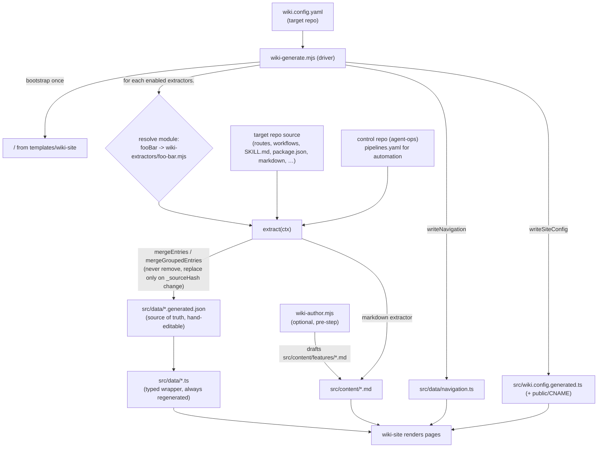

# scripts/ — the shared wiki generator engine

This directory is the engine behind
[`.github/workflows/wiki-generate-reusable.yml`](../.github/workflows/README.md).
It reads a **target repo's** `wiki.config.yaml` and produces the data + content
files that a bootstrapped [`wiki-site`](../templates/README.md) renders — a docs
site derived from the target repo's own source, additively and idempotently.

- **`wiki-generate.mjs`** — the driver.
- **`wiki-author.mjs`** — optional LLM authoring step for missing feature prose.
- **`check-flow-coverage.mjs`** — the e2e critical-flow coverage checker (used by
  `e2e-pipeline-reusable.yml`, not by the wiki flow).
- **`wiki-extractors/*.mjs`** — one module per data kind + shared helpers.
- **`package.json`** — the only runtime dependency is `yaml`.

Related: [`../README.md`](../README.md) · [`../templates/README.md`](../templates/README.md)
· [`../.github/workflows/README.md`](../.github/workflows/README.md)

---

## Data flow



---

## `wiki-generate.mjs` (driver)

```sh
node scripts/wiki-generate.mjs \
  --repo-root   /path/to/target-repo \
  --control-repo /path/to/agent-ops \
  [--config     /path/to/target-repo/wiki.config.yaml] \
  [--site-dir   docs]
```

Env-var equivalents (used by the reusable workflow): `WIKI_REPO_ROOT`,
`WIKI_CONTROL_REPO`, `WIKI_CONFIG_PATH`, `WIKI_SITE_DIR`.

What it does, in order:

1. **Load + validate** `wiki.config.yaml` (`wiki-extractors/config.mjs`). Requires
   `site.title`, an `extractors:` block, and `output.dataDir` / `output.contentDir`.
2. **Bootstrap the site once** — copies `templates/wiki-site` into `<site-dir>`,
   but **only files that don't already exist** there. It never overwrites a
   hand-customized site file; the only files the generator owns and rewrites are
   `src/data/*.generated.json`, `src/data/*.ts`, `src/content/*.md`,
   `src/data/navigation.ts`, and `src/wiki.config.generated.ts`.
3. **Run exactly the extractors the config declares** (see resolution
   convention below).
4. **Derive `navigation.ts`** from whichever data kinds were enabled — top nav +
   sidebar sections, never hand-maintained. Markdown pages get one section per
   distinct `navSection`.
5. **Write `src/wiki.config.generated.ts`** — a literal, deterministic
   theme/title/backend module (never LLM-generated). Writes `public/CNAME` if
   `site.customDomain` is set.

### Extractor resolution convention

The core loop is fully generic — nothing is hardcoded per extractor kind. For
each key under `extractors:`, the driver converts the **camelCase** config key
to a **kebab-case** module filename and imports it:

```
extractors.endpointsExpress  ->  scripts/wiki-extractors/endpoints-express.mjs
extractors.appList           ->  scripts/wiki-extractors/app-list.mjs
extractors.skills            ->  scripts/wiki-extractors/skills.mjs
```

The module must export `async function extract(ctx)`. If the module is missing
or doesn't export `extract`, the driver warns and skips that key. `ctx` is:

```js
{ repoRoot, siteRoot, config, outputPaths, controlRepoRoot }
```

Each `extract()` returns `{ skipped: true }` when its `enabled` flag is false,
or a report `{ kind, added, updated, unchanged, stale, merged }`.

### Adding a new extractor

1. Add `scripts/wiki-extractors/<kebab-name>.mjs` exporting `extract(ctx)`.
2. Use the shared merge helpers (below) so it stays additive/idempotent.
3. Write `src/data/<name>.generated.json` (source of truth) + a thin
   `src/data/<name>.ts` typed wrapper via `writeGeneratedTsWrapper`.
4. Add the matching camelCase key under `extractors:` in the target repo's
   `wiki.config.yaml`.
5. If it needs a nav section, add a branch in `writeNavigation()` in
   `wiki-generate.mjs`, and a type in the site's `src/types`.

The driver's loop itself never changes.

---

## `wiki-author.mjs` (optional authoring agent)

```sh
node scripts/wiki-author.mjs --repo-root <target> --site-dir <dir> \
  [--manifest wiki-content/authoring.yaml] [--model documentation]
```

Produces the **prose** the `features` extractor later parses. For each feature
in an authoring manifest whose `src/content/features/<slug>.md` doesn't yet
exist, it asks the model behind the LiteLLM **`documentation`** alias (see
[`../litellm/README.md`](../litellm/README.md)) to draft the file in the exact
frontmatter format the features extractor expects.

Deliberately conservative:

- **No-op** (exit 0) when `LITELLM_PROXY_URL` / `LITELLM_VIRTUAL_KEY` are unset,
  so a normal generate run is unaffected.
- **Never overwrites** an existing authored file — committed/human prose wins.
- **No-op** when there is no manifest.
- All calls go **through the gateway** (`POST /v1/chat/completions`); no provider
  SDK or key is used here.

---

## `check-flow-coverage.mjs` (e2e coverage gate)

Used by [`e2e-pipeline-reusable.yml`](../.github/workflows/README.md), not the
wiki flow.

```sh
node check-flow-coverage.mjs <path-to-manifest.yaml>
```

Cross-checks a repo's critical-flow manifest against actual test results:
"every *declared* flow specifically ran and passed," not just "the suite
passed." Manifest shape:

```yaml
flows:
  - announcement-bar-enable-disable
  - bundle-checkout
```

A flow is "covered" if its name appears as a **substring of at least one
passing test's identifier**. It reads whichever report is present — Playwright
JSON (`test-results/results.json`) or JUnit XML (under
`build/outputs/androidTest-results` / `build/reports/androidTests`). Exit codes:
`0` = pass / nothing to check, `1` = missing flows or no results found.

---

## The extractors (`wiki-extractors/`)

Shared helpers:

- **`config.mjs`** — `loadWikiConfig()` (load + validate) and
  `resolveOutputPaths()`.
- **`glob.mjs`** — a thin wrapper over Node's built-in `fs.globSync` (Node 22+),
  returning repo-relative POSIX paths and always excluding
  `node_modules`/`.git`/`dist`/`build`/`.next`.
- **`merge.mjs`** — the additive/idempotent engine every extractor uses:
  `mergeEntries`, `mergeGroupedEntries`, `hashSource`, `stableStringify`,
  `readJsonSidecar`, `writeJsonSidecar`, `writeGeneratedTsWrapper`.
  Key rules: an entry is **never removed** even if its source disappears (stale
  entries are left as-is); an existing entry is replaced **only** when its
  `_sourceHash` (or a structural diff, as a fallback) actually changes; new
  entries are appended in extractor order. This is what makes hand-editing a
  `.generated.json` sidecar between runs safe.

Data-producing extractors:

| Config key | Module | Reads | Emits (`src/data/…`) |
|---|---|---|---|
| `features` | `features.mjs` | Authored `src/content/features/*.md` frontmatter (the authored layer). | `features.generated.json` / `features.ts` |
| `endpointsExpress` | `endpoints-express.mjs` | Express router files (`router.get/post/...`) + mount file. | `endpoints.generated.json` / `endpoints.ts` |
| `endpointsKotlin` | `endpoints-kotlin.mjs` | Kotlin Retrofit `@GET/@POST/...` interfaces. | `endpoints.*` (same target; a repo enables only one endpoints kind) |
| `workflows` | `workflows.mjs` | `.github/workflows/*.yml` (uses each file's first `#` comment block as the description). | `workflows.generated.json` / `workflows.ts` |
| `automation` | `automation.mjs` | The **control repo's** `orchestrator/src/registry/pipelines.yaml`, filtered by `repoMatch`. | `automation.generated.json` / `automation.ts` |
| `skills` | `skills.mjs` | Every `SKILL.md` under configured roots (frontmatter, verbatim). | `skills.generated.json` / `skills.ts` |
| `dependencies` | `dependencies.mjs` | Each listed `package.json`'s deps/devDeps, verbatim. | `dependencies.generated.json` / `dependencies.ts` |
| `integrations` | `integrations.mjs` | Authored `integrations:` list in `wiki.config.yaml` (non-npm third parties). | `integrations.generated.json` / `integrations.ts` |
| `markdown` | `markdown.mjs` | Existing markdown per glob, copied **byte-for-byte** into `src/content/`. | `pages.generated.json` / `pages.ts` |
| `tests` | `tests.mjs` | Suite-level test globs (counts files; doesn't parse cases). | `tests.generated.json` / `tests.ts` |
| `changelog` | `changelog.mjs` | Authored `wiki-content/changelog.yaml` (`{date, added?, changed?, fixed?}`). | `changelog.generated.json` / `changelog.ts` |
| `appList` | `app-list.mjs` | A frontend "app list" source file (widget/plan config literals). | `apps.generated.json` / `apps.ts` |

---

## `wiki.config.yaml` schema

Loaded and validated by `config.mjs`. Top-level keys:

```yaml
site:
  title: "…"            # required
  description: "…"
  theme:                # any CSS colors; hover/muted computed from accent if omitted
    accent: "#14b8a6"
    accentHover: "#0f9488"
    accentMuted: "rgba(20,184,166,0.1)"
  favicon: "/favicon.svg"
  githubUrl: "https://github.com/OWNER/REPO"
  customDomain: "docs.example.com"   # optional -> written to public/CNAME

backend:                 # optional; drives the Sandbox "Try it" proxy
  proxyBaseUrl: "https://…"          # deployed wiki-backend URL
  targetApiBaseUrl: "https://…"      # real API the proxy forwards to

extractors:              # required; run only the ones with enabled: true
  # see per-extractor keys below

output:                  # required
  dataDir: "src/data"
  contentDir: "src/content"
```

Per-extractor keys (all under `extractors:`; every one takes `enabled: true|false`):

| Key | Extra fields |
|---|---|
| `features` | `dir` (default `features`) — subdir of `contentDir`. |
| `endpointsExpress` | `routesGlob[]`, `mountFile`, `controllerDir?`, `publicRouteFiles[]?`, `apiPrefix?`. |
| `endpointsKotlin` | `interfaceGlob[]`. |
| `workflows` | `glob[]`, `exclude[]`. |
| `automation` | `pipelinesYamlPath` (resolved against the **control repo**), `repoMatch` (`owner/name`). |
| `skills` | `roots[]` (default `[skills]`). |
| `dependencies` | `manifests[]` (paths to `package.json`s). |
| `integrations` | `items[]` — each `{ slug, name, kind, summary, auth, url?, notes[]? }` (authored literals). |
| `markdown` | `sources[]` — each `{ glob, navSection }`. |
| `tests` | `suites[]` — each `{ name, framework, glob, description? }`. |
| `changelog` | `source` (default `wiki-content/changelog.yaml`). |
| `appList` | `sourceFile`, `widgetConfigExport`, `planFeaturesExport`. |

A full annotated example lives at
[`../templates/wiki-site/wiki.config.example.yaml`](../templates/wiki-site/wiki.config.example.yaml);
this repo's own real config is [`../wiki.config.yaml`](../wiki.config.yaml).
